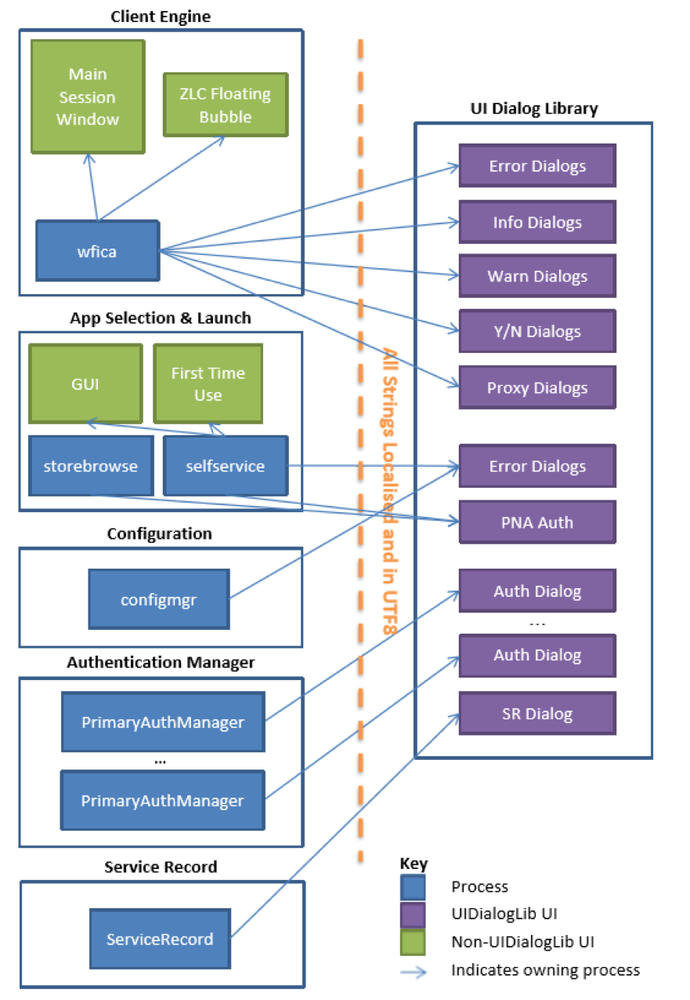

# Customize Citrix Workspace app for Linux  

This section contains task-based procedures for customizing Citrix Workspace app for Linux. Where possible, examples and context are provided as well as instructions for developing and configuring Citrix Workspace app.  

The following aspects can be customized:  

* Installation  
* User interface  
* Security  
* Multimedia  
* Performance  

## Customize a Citrix Workspace app for Linux installation 
 
You can customize Citrix Workspace app configuration before installation by modifying the contents of the package and then repackaging the files. Your changes will be included in every Citrix Workspace app installed using the modified package.  

### To customize a Citrix Workspace app for Linux installation  

1.	Expand the Citrix Workspace app package file into an empty directory. The package file is called **platform.major.minor.release.build.tar.gz** (for example, **linuxx86-13.4.0.10109380.tar.gz** for the Linux/x86 platform).  
2.	Make the required changes to the Citrix Workspace app package. For example, you might add a new SSL root certificate to the package if you want to use a certificate from a Certificate Authority that is not part of the standard Workspace app installation. To add a new SSL root certificate to the package, see **Install root certificates on user devices**. For more information about built-in certificates, see **Configure and enable SSL and TLS** on the [Product Documentation](https://docs.citrix.com/) site.  
3.	Open the PkgID file.  
4.	Add the following line to indicate that the package was modified: `MODIFIED=traceinfo` Where `traceinfo` is information indicating who made the change and when. The exact format of this information is not important. 
5. Save and close the file.  
2.	Open the package file list, platform/platform.psf (for example, linuxx86/ linuxx86.psf for the Linux/x86 platform).  
3.	Update the package file list to reflect the changes you made to the package. If you do not update this file, errors may occur when installing your new package. Changes could include updating the size of any files you modified, or adding new lines for any files you added to the package. The columns in the package file list are:  
	* File type  
	* Relative path  
	* Sub-package (which should always be set to cor)  
	* Permissions  
	* Owner  
	* Group  
	* Size
4. Save and close the file.  
2. Use the tar command to rebuild Workspace app package file, for example: `tar czf ../newpackage.tar.gz *`  

### About the configuration files  

To change advanced or less common session settings, you can modify Workspace app's configuration files. These are read each time wfica starts. You can update various different files depending on the effect you want the changes to have.  
Be aware that, if session sharing is enabled, an existing session might be used instead of a newly reconfigured one. This might cause the session to ignore changes you made in a configuration file.  

### Apply default to all Citrix Workspace app users  

If you want to change the default for all Citrix Workspace app users, modify the module.ini configuration file in the `$ICAROOT/config` directory. 

Note: You do not need to add an entry to All\_Regions.ini for a configuration value to be read from module.ini, unless you want to allow other configuration files to override the value in module.ini. If an entry in All\_Regions.ini sets a specific value, the value in module.ini is not used.
  
### Apply changes to new Workspace app users
  
If you want the changes to apply to all future new Workspace app users, modify the configuration files in the `$ICAROOT/config` directory. For changes to apply to all connections, update wfclient.ini in this directory.  

### Apply changes to all connections for particular users 
 
If you want the changes to apply to all connections for a particular user, modify the wfclient.ini file in that user’s `$HOME/.ICAClient` directory. The settings in this file apply to future connections for that user.  

Note: If an entry appears in more than one configuration file, a value in wfclient.ini takes precedence over a value in module.ini.  
 
### About the parameters in the files  

The parameters listed in each file are grouped into sections. Each section begins with a name in square brackets indicating parameters that belong together; for example, [ClientDrive] for parameters related to client drive mapping (CDM). 
 
Defaults are automatically supplied for any missing parameters except where indicated. If a parameter is present but is not assigned a value, the default is automatically applied; for example, if `InitialProgram` is followed by an equal sign (=) but no value, the default (not to run a program after logging in) is applied.  

### Precedence  

All\_Regions.ini specifies which parameters can be set by other files. It can restrict values of parameters or set them exactly.  

For any given connection, the files are generally checked in the following order:

1.	All\_Regions.ini. Values in this file override those in:  
	* The connection's .ica file  
	* wfclient.ini  
2.	module.ini. Values in this file are used if they have not been set in All\_Regions.ini, the connection's .ica file, or wfclient.ini but they are not restricted by entries in All\_Regions.ini.  

If no value is found in any of these files, the default in the Citrix Workspace app code is used.  
  
Note: There are exceptions to this order of precedence. For example, the code reads some values directly from wfclient.ini for security reasons, to ensure they are not set by a server.  

## User Interface  

This topic guides you through the steps for customizing the Workspace app user interface (UI) and Workspace app connections. This might require you to modify configuration files, run command-line utilities with options that you specify, or develop plug-ins.
  
In addition to the information presented here, consult the User experience topics in the Workspace app for Linux section on the Product Documentation site.  

Citrix provides a set of graphics assets that you can use to modify the Citrix Workspace app UI in this release. To obtain these assets and a specification to help with the modifications, contact the Citrix Ready team.  

### Customize Citrix Workspace app using storebrowse 
 
You can customize Workspace app by wrapping your own UI around the storebrowse command-line utility.  

When used with Citrix StoreFront, storebrowse is equivalent to the deprecated pnabrowse utility. storebrowse takes options on the command line and returns results to its standard output, launches sessions, and so on.  

storebrowse uses the concept of a resource name. Unlike an application's display name, which can be duplicated, a resource name is unique. For example, there could be a Microsoft Outlook® display name in both an Office 2010 folder and an Office 2007 folder. Therefore, all operations such as launch take the resource name as the argument, and icons are stored with the resource name as the root of the file name. Resource names are long and not necessarily human readable, but result in efficient scripts.  

When entering a server address, you can omit the https:// or http:// prefix. storebrowse first tests the supplied URL as an HTTPS address and then, if that fails, as an HTTP address. StoreFront servers are not supported with the http:// prefix. To access resources via HTTP connections with storebrowse, you must set PNASite.

You can use an IP address instead of a FQDN for HTTP connections to PNAgent servers. 
 
You can enter the FQDN or e-mail address (providing [E-mail Based Account Discovery](https://www.citrix.com/blogs/2013/04/01/configuring-email-based-account-discovery-for-citrix-receiver/) is configured) to setup a StoreFront connection. For Program Neighborhood Agent setup the URL of the server is required. The FQDN of the of the PNAgent server may be used if the config.xml is located in the default place &lt;FQDN&gt;/Citrix/PNAgent/, you must enter the full URL to the config.xml if your PNAgent setup is non-default.  

To understand the command-line options that you can use with storebrowse, see the Reference information section of this document.  

### Using storebrowse with PNA servers

When connecting to a Program Neighborhood Agent (PNA) server, you can use storebrowse as a replacement for pnabrowse. storebrowse differs from pnabrowse in the following respects:  

* Support for Kerberos passwords is withdrawn; the `-k` option is no longer accepted.  
* Support for the old icabrowse utility has been removed. That is, the `‑A`, `-u`, `-p`, and `-c` options are no longer accepted. The `-S` option is accepted but is now used to show subscribed applications on StoreFront servers.  
* When using the `-U`, `-P`, and `-D` options with Program Neighborhood Agent sites, the following notes must be considered. Citrix recommends that you do not use these options and instead let the system prompt users for their credentials:  
	* Storebrowse launches a daemon process so that PNA credentials can be stored between calls. By default, this process terminates after one hour of the last call to storebrowse, at which point the credentials are deleted.  
	* To configure a different timeout, create the file  
`$ICAROOT/config/storebrowse.conf` containing the required timeout in seconds followed by a new line. If the value zero is used, credentials are not stored for PNA sites (but the daemon process still runs).
	* You can terminate the daemon process early by calling `storebrowse --killdaemon`.  
* Long versions of each option are now available. This allows scripts to be more readable. For example, `--enumerate` can be specified instead of `-E`.  
The `‑r` option (long option `‑‑icaroot`) now specifies the root directory of the Workspace app installation.

### Migrate to storebrowse 
 
If you are migrating from a pnabrowse environment to a storebrowse one, the following information may help with any customizations that you make using that command-line utility:  

* Adding and removing StoreFront stores is easy:  
	* To add a store, users enter the URL of the StoreFront server or, if email-based account discovery is configured, they enter their email address. For information on email-based account discovery, see the StoreFront documentation in Citrix product documentation. The `--addstore` command writes to standard output that should be passed to all future storebrowse calls regarding this store. 
* StoreFront stores can now be used as sources of applications and desktops. Users can perform all of these tasks with storebrowse. These are new except for the -E and `-L` options that were also present in pnabrowse:  
	* Add (using `-a`), delete (`-d`), and list (`-l`) stores.  
	* List all of the desktops and applications in a store (using `-E`), and list all of these that the user has subscribed to (`-S`).  
	* Subscribe to an application (using `-s`), and launch it (`-L`).  
	* Change a store's default gateway (using `-g`). 
* Subscribing to an application or desktop gives users control and reduces administration:  
	* Once users are connected to the store, they can subscribe to desktops and applications in it; administrators do not have to handle subscriptions  
	* Subscriptions are stored locally, in Workspace app, when connecting to a Program Neighborhood Agent server but remotely when connecting to a StoreFront server.  
* Logons are handled differently with storebrowse:  
	* Authentication Manager prompts for credentials when necessary. Unlike pnabrowse, storebrowse lets Authentication Manager process logon prompts. Before you can use the `-U`, `-P`, and `-D` options, both the StoreFront server and the Citrix Workspace app must be configured to allow the HTTP Basic authentication method. See S**torebrowse Classic Password Insertion for StoreFront** in the **Credential Insertion SDX**. Otherwise the client will prompt for credentials as normal. When the `-U`, `-P`, and `-D` options are used, the credentials are stored into Authentication Manager's Single Sign on (SSO) cache for subsequent authentications. 

### Storebrowse examples  

#### Add a store 
 
The following command lines are alternative ways of adding a store:  

```
./util/storebrowse -a 'my.examplestore.net'  ./util/storebrowse --addstore 'https://  
my.secondexamplestore.net/Citrix/Second/discovery'  
```

Adding stores with storebrowse serves two purposes: it defines which stores can be used by the self-service command, and it allows Service Record daemon, which is responsible for gateway management, to function correctly. 
 
To add a store and cache SSO credential at the same time, use the following syntax:  

```
./util/storebrowse -U username -D domain -P password -a  'my.examplestore.net'  
```

Older versions of StoreFront (version 3.0 and the earlier versions) can require the user credentials when adding the store as they can be required to log on to the server.  

If the store being added does not immediately require the user to authenticate, the given credentials are cached in the SSO container for later use.  

The credentials stored in the SSO container are shared among storebrowse calls as long as they are not removed from the cache or as long as Authentication Manager is running, that is, terminating AM would clear the credential cache.
  
When a set of credentials have been inserted, they can be omitted in any subsequent usage of storebrowse that requires that same credentials.  

When it adds a store, storebrowse displays the URL that you should use to specify that store.  

#### List stores  

The following command lines list stores. 

```
./util/storebrowse -l   
./util/storebrowse --liststores   
```

The output from both of these list commands is identical and might be as follows:  

```
'https://my.examplestore.net/Citrix/Store/discovery' 'Store'  
'Store' '149397992' '"My Default  
GW",https://my.defaultgateway.com' '"Alternative  
Gateway",https://my.alternativegateway.com,"Alternative Gateway  
2",my.alternativegateway2.com'  
'https://my.secondexamplestore.net/Citrix/Second/discovery'  
'Second' 'Store 2' '401460086' '"Alternative  
Gateway",https://my.alternativegateway.com' '"My Default GW",https://my.defaultgateway.com,"Alternative Gateway 
2",my.alternativegateway2.com'  
```

storebrowse lists stores in the following format, where \t is a Tab character.  

```
'<Store URL>'\t'<Store Name>'\t'<Store Friendly  
Name>'\t'<Unique Store ID>'\t'"<Current Gateway  
Name>",<Current Gateway URL>'\t'"<Alternative Gateway 1 Unique  
Name>",<Alternative Gateway 1 URL>, … "<Alternative Gateway n 
Name>",<Alternative Gateway n URL>'  
```

#### Delete a store  

The following command lines delete a store:  

```
./util/storebrowse -d fullStoreURL   
./util/storebrowse --deletestore fullStoreURL   
```

The store URL passed to the command must match the value shown by command:  

```
storebrowse -l
```

Deleting a store does not remove any credential from the SSO container, as that particular store might have been added without specifying SSO credentials, or the cached SSO credentials might still be required by any of the remaining stores. 
 
To remove the credentials from SSO, use the specific command: `storebrowse -K`.  

#### Enumerate apps/desktops 
 
The following command enumerates the apps/desktops available on the specified StoreFront server:  

```
./util/storebrowse -U username -D domain -P password -E fullStoreURL 
```
 
The store URL passed to the command must match the value that was written to standard output when it was added. This can be shown by the command: `storebrowse -l`.

The credentials can be omitted if they have been already inserted in SSO by a previous storebrowse call.  

#### Launch an app/desktop  

The following command launches the given app/desktop published on the specified StoreFront server:  
 
```
./util/storebrowse -U username -D domain -P password -L appOrDesktopName fullStoreURL  
```

The app/desktop name must match the value shown by `storebrowse -E`. The store URL must match the value that is shown by `storebrowse -l`. 
 
The credentials can be omitted if they have been already inserted in SSO by a previous storebrowse call. 
 
#### Remove the SSO credentials
  
The following command lines remove the most recent set of credentials stored in the SSO cache:  

```
./util/storebrowse -K   
./util/storebrowse --killdaemon   
```

The command returns successfully even when no credentials are actually present in the internal credential cache.  

#### Set a default gateway 
 
The following example specifies the default gateway for a store. Gateways are points at which users outside an organization’s firewall access a store. storebrowse (and the self-service UI) let you define the default gateway for a machine. For example, machines in two locations might access the same store through two different gateways.  

```
./util/storebrowse --storegateway "Alternative Gateway" 'https://my.examplestore.net/Citrix/Store/discovery'  
```

#### Enumerate resources on a Program Neighborhood Agent server  

The following example command line enumerates all of the available resources on a Program Neighborhood Agent server. The server's URL is specified in the final argument. The command line outputs the default information and saves the 48-bit icon associated with the resource. The file name is part of the output. 

``` 
storebrowse --enumerate --icons 48x https://my.example.net/ Citrix/Store/PNAgent/config.xml  
```

## Customize the self-service UI 
 
You can customize the appearance of the self-service user interface (UI) in Citrix Workspace app.  

Note: For X1 connections the core self-selection interface is configurable on the server. For the now legacy green UI, it is still possible to modify it locally. 
 
Because the legacy green UI is based on the Workspace app for Web, you can use that component's customization interface to modify the UI. For example, you can rebrand the UI by creating a new skin based on an alternative CSS and your own images. 
 
Note: You cannot customize the logon dialog boxes in this way. Use the Workspace app UI dialog library instead. For more information, see UI Dialog library.  

Typically, you customize the contents of the following subfolders of `$ICAROOT/site`. These contain the Workspace app for Web code, which is rendered by the self-service UI as its interface:  

* /contrib - Customizable JavaScript and CSS files, which are documented in the comments of each file  
* /media - Icons and other graphics 

The following subfolders also exist, but you are unlikely to need to customize these:  

* /scripts - Third-party JavaScript files, an obfuscated JavaScript file, and localized strings.   
* /css - Third-party CSS files and an obfuscated CSS file. You cannot edit the files named Default\_\*.\*.  
* /uiareas - Site images.

To help modify the self-service UI, you can run the underlying web code in a standalone mode using a web browser. This lets you use standard web tools (for example, Firebug for Firefox) to inspect and modify the site. To run it in standalone mode, load the site `$ICAROOT/site/selfservice.html?standalone` in a browser. 
 
For other information on customizations based on Workspace app for Web, see [CTX134791](https://support.citrix.com/article/CTX134791) and [http://blogs.citrix.com/2012/06/06/customizing-receiver-for-web/](http://blogs.citrix.com/2012/06/06/customizing-receiver-for-web/).  

In addition to the self-selection UI, it is also possible to rebrand some other screens. The Shared User Mode logon screen, the Offline Error screen and the Loading Spinner screen can be customized by modifying the site rendered by `$ICAROOT/site/sum_screen/SharedUserMode.html`, `$ICAROOT/site/native/error.html`, and `$ICAROOT/site/native/loading.html` respectively. 

### Preferences  

The Preferences UI in Citrix Workspace app is implemented as a separate binary,  
`$ICAROOT/util/configmgr`, which edits the configuration files, and gets and sets values using storebrowse. For complex customizations, you can replace configmgr. 
 
Note: Many of the configuration options were available in wfcmgr, which is no longer available. For more information on them than is provided here, consult an earlier version of this document.

### General page
  
The General page uses the `UseFullScreen=True/False` setting in the [Thinwire3.0] section of wfclient.ini, and the following storebrowse commands.

```  
--configselfservice ReconnectOnLogon=True/False
```
  
The setting ReconnectOnLogon corresponds to the “Reconnect apps and desktop: When I start Workspace app” preference, and determines whether the self-service UI tries to reconnect to all sessions, for a given store, immediately after logon to that store. 

``` 
--configselfservice ReconnectOnLaunchOrRefresh=True/False
```
  
The setting ReconnectOnLaunchOrRefresh corresponds to the “Reconnect apps and desktop: When I start or refresh apps” preference, and determines whether the self-service UI tries to reconnect to all sessions when an application is launched or the store is refreshed.

### Accounts page 
 
The Accounts page uses the following storebrowse commands to add, remove and edit stores.

```  
--addstore <store URL or e-mail>   
--deletestore <store URL>   
--storegateway <gateway name> 
```  
If you have multiple stores, use the following command to define which one is displayed when the user first starts Workspace app. 

``` 
./util/storebrowse --configselfservice 
DefaultStore=<store URL>  
```

### File Access page 
 
The File Access page uses the following settings in the [WFClient] section in wfclient.ini to add, remove, and change read-write access to mapped drives. Replace the ? (question mark) with the letter of the drive that you want to map. 

| Setting | Description |
|---|---|
| CDMAllowed=True/False  | Enables the client drive mapping feature. Mapped drives only appear in a session if this setting is enabled. |
| DrivePath?=/a/path  | Sets the path (including drive) that you want to map. For example, to map P: to /my/directory, configure this setting as follows: `DrivePathP=/my/directory` |
| DriveEnabled=True/False | Enables the specified drive.  |
| DriveReadAccess=0/1/2 | Gives read access to the specified drive. For more information on this, see Configuration files later in this document. | 
| DriveWriteAccess=0/1/2  | Gives write access to the specified drive. For more information on this, see Configuration files later in this document. |

### Mic and Webcam page 
 
The Mic & Webcam page uses the setting `AllowAudioInput=True/False` in the [WFClient] section in wfclient.ini.  

### Flash page
  
The Flash page uses the `HDXFlashUseFlashRemoting` setting in the [WFClient] section in wfclient.ini.  

### Customize connections using the Platform Optimization SDK
  
Workspace app connections can be customized by creating plug-ins to perform one or more of the following functions:
  
* Provide accelerated decoding of JPEG and H.264 data used to draw the session image  
* Control the allocation of memory used to draw the session image  
* Improve performance by taking control of the low-level drawing of the session  
* Provide graphics output and user input services for OS environments that do not support X11  

You can develop plug-ins for decoding independently of the other types listed, unless they also need to control memory allocation. To test any plug-ins that you develop, you may need to rename them and you must copy them to the Workspace app installation directory.  

Citrix Workspace app supports additional plug-ins for accelerated audio and video codecs, but no SDK is provided for these in this release. Workspace app can also be configured to use GStreamer for webcam and multimedia functions. These plug-ins are standard GStreamer components and are not covered in this document.  

Important:  Plug-in development in a non-X-Window system might require a specialized toolkit and customization of the UI dialog library in the Workspace app.  

The following tables describe the shared library files that you should be aware of when developing plug-ins with the Platform Optimization SDK. If Workspace app cannot locate or use a file, the fallback file (where available) is used instead.  

| File  | Purpose  | Fallback file  | Notes  |
|---|---|---|---|
| ctxjpeg.so  |Citrix decoder for JPEG images  | libjpeg Version 6:  ctxjpeg\_fb.so libjpeg Version 8: ctxjpeg\_fb\_8.so  | The fallback decoder files are used only in ARM environments; the Workspace app provides its own built-in fallback JPEG decoder in x86 environments. If you develop your own decoder, you must call it ctxjpeg.so. | 
| ctxh264.so  | Citrix decoder for H.264 images | ctxh264\_fb.so  | ctxh264.so decodes H.264 graphics only; HDX MediaStream for Windows Media and HDX. MediaStream for Flash use different mechanisms to display H.264 video and movie content. | 
| KVMEPlugin. so | Memory allocation  | SOCX11plugin\_COMPAT.so | The binary fallback file is only provided for ARM deployments. For x86 deployments, the source is available and can be compiled.  |

Note: KVMEPlugin.so can also be used for screen drawing.  

You can enable or configure some plug-ins using the following files (and additional system components). In these cases, no fallback files are employed and source files, for plug-in development, are not supplied.  

| File  | Purpose  | Notes  |
|---|---|---|
| KVMEPlugin.so | Screen drawing  | No fallback file is available, but a sample, SOCX11\_plug.c, is included in this release. You can use this to develop a custom OpenGL implementation, for example. <br><br> **Note**: KVMEPlugin.so is also used for memory allocation. |
| VORBIS.DLL | Decoder for nonspeech audio data  | You can use these files for standard audio (not HDX MediaStream Windows Media or HDX MediaStream for Flash). <br><br>**Important**: Do not replace these files. When customizing the standard audio decoder, replace the system libvorbis.so or libspeex.so library files instead. Any replacements must be API compatible. | 
| SPEEX.DLL | Decoder for speech audio data | You can use these files for standard audio (not HDX MediaStream Windows Media or HDX MediaStream for Flash). <br><br>**Important**: Do not replace these files. When customizing the standard audio decoder, replace the system libvorbis.so or libspeex.so library files instead. Any replacements must be API compatible. |
| gst\_read, gst\_read0.10, gst\_read1.0 | A GStreamer utility required for HDX. <br><br> RealTime Webcam Video Compression | The 0.10 versions are for use with GStreamer 0.10 and the 1.0 versions are for use with GStreamer1.0. During installation, links with the generic name are created to the versions which will be used. <br><br> **Important**: Do not replace these files. For information on customizing these HDX features, see HDX RealTime Webcam Video Compression later in this document. |
| gst\_play, gst\_play0.10, gst\_play1.0 | A GStreamer utility required for HDX <br><br> MultiStream Windows<br><br>Media Redirection | The 0.10 versions are for use with GStreamer 0.10 and the 1.0 versions are for use with GStreamer1.0. During installation, links with the generic name are created to the versions which will be used. <br><br> **Important**: Do not replace these files. For information on customizing these HDX features, see HDX RealTime Webcam Video Compression later in this document. |
| FlashContainer.bin | Provides support for HDX MediaStream Flash Redirection | For details, see Flash in this document. |

### Plug-ins for H.264-based session graphics 
 
For XenApp/XenDesktop 7.0-7.8, the preferred protocol for presenting the remote session's graphics uses a combination of H.264 and proprietary lossless graphics encoding. For maximum flexibility in exploiting on-chip decoders and hardware rendering support, plug-ins can take full control of the decoding, overlay, and rendering process.  

The details of the interface for these plug-ins are documented as comments in the associated header file, H264\_decode.h. A stub implementation is included in the H264_sample directory.  

### Plug-ins for accelerated JPEG decoding 
  
All currently supported versions of XenDesktop and Citrix XenApp® for UNIX® can use JPEG to compress portions of the session image. Plug-ins that support hardware-accelerated JPEG decoding can improve graphics performance for sessions when not using H.264 session graphics.  

Moreover, for XenApp/XenDesktop 7.9 and later, the preferred protocol for presenting graphics is a combination of JPEG and a proprietary lossless graphics format, similar to versions prior to 7.0. Improvements in the server graphics encoding technology have resulted in a lower bandwidth profile, lower server CPU usage and higher overall visual quality than if H.264 were to be used for session graphics instead.  

The details of the interface for these plug-ins are documented as comments in the associated header file, jpeg\_decode.h. The sample code jpeg\_sample demonstrates how wfica falls back when no accelerated plugin is available. It builds a plug-in called ctxjpeg\_fb.so.  

JPEG fallback is employed if necessary to ensure images are displayed efficiently on the user device. The following decoders are used in this order: 

On ARM platforms: 
 
* ctxjpeg.so  
* ctxjpeg\_fb\_8.so if Version 8 of libjpeg is present
* ctxjpeg\_fb.so if Version 6 of libjpeg is present  

On x86 platforms:  

* ctxjpeg.so
* the built-in decoder  
 
### Plug-ins for memory allocation 
 
The following information may be useful if you want to hardware accelerating JPEG decoding, H.264 decoding, or screen drawing.
  
Hardware-accelerated plug-ins for H.264 or JPEG decoding may need to allocate memory buffers with special characteristics, for example using physically contiguous pages. A single plug-in component, KVMEPlugin.so, is used for both standard memory allocation and for drawing the session image. If you are using the plug-in for memory allocation, you must supply only two functions.  

The header file for memory allocation plug-ins is mainloop.h. The two entry points that must be implemented are `special\_allocate()` and `special\_free()`. The example code is in the allocation\_sample directory. Before using this code as a model for your own plug-in, pay careful attention to the comments in the code. Parts of it are present only for backward compatibility with decoder plug-ins that were developed for obsolete versions of Citrix Workspace app.

### Plug-ins for faster drawing in X11 environments
  
In some environments using X11, other drawing methods might be faster than the calls to `XShmPutImage()` that are used by default. You can implement KVMEPlugin.so using an alternative drawing method by providing the `draw()` entry point, which is used to send the session image to the screen. You can also provide the optional `draw_complete()` entry point. When these alternative entry points are used, you do not additionally have to implement the memory allocation functions.  

The example code in the allocation\_sample directory includes an implementation that is almost identical to the default drawing code.  

### Plug-ins for non-X11 environments  

The Platform Optimization SDK includes a separate version of the Workspace app engine called wfica\_for\_plugins. This is not linked with any X11 libraries. The program requires a version of KVMEPlugin.so that provides video output, mouse and keyboard input, and timer and event detection services. The following features of the X11 version are not yet available in the separate version: clipboard, seamless windows, multimedia and Flash support.  

Two example plug-in implementations are included: 
 
* SDL\_plugin contains an implementation based on the SDL library.  
* FB\_plugin contains a version based on Linux system calls and device files. It uses the raw frame buffer for display. 

Support for environments that use Simple DirectMedia Layer (SDL) depends on how the library is built. 

Usually, X11 and frame buffer graphics are supported. To use frame buffer graphics, run the program from a text console as a superuser, or change the permissions on the /dev/fb0 and /dev/mice files and then run it. The frame buffer plug-in needs access to these device files. 

### UI Dialog library  

For alternative windowing systems to X Windows and their toolkits, you can develop customized dialogs using the Workspace app for Linux UI dialog library described in this topic. The library is a C interface that can represent dialogs containing a selection of widgets: labels, text boxes, check boxes, radio buttons, combo boxes, multi-select combo boxes, buttons, expanders, hyperlink, scrolled view, selection table, and button box. The library is loaded as a shared object file (UIDialogLib.so). 
 
The UI dialog library is used for most of the dialogs that are displayed by Workspace app for Linux processes, including the X11-based wfica. The processes storebrowse, AuthManager, PrimaryAuthManager, and ServiceRecord use it for their entire user interface (UI). By reimplementing the library, you can replace the UI of these essential processes with a toolkit of your choosing. Except for dialogs, the remaining processes (self-service, configmgr, and X11 wfica binaries) require GTK+ for other aspects of their UI, and therefore cannot be used with a different implementation of the library than the GTK+ implementation provided with Workspace app.
  
However, all of their functionality is available in the storebrowse command-line utility and the configuration files. The graphic on the following page represents the library's architecture and use by Workspace app components. Note that two further utilities, Connection Center and xcapture are completely dependent on X11 and are not shown on this graphic. 

UI Dialog libraries include libwebkit2gtk (2.16.6). The newly added libraries are UIDialogLibWebKit3.so and UIDialogLibWebKit3_ext.so. For instructions on getting started with the UI Dialog library, see the Readme in the UIDialogLib3 directory.
 
For further documentation and examples to aid implementation of the API, refer to the Platform Optimization SDK. 

 

### Security
  
#### Certificates  

StoreFront sites use the HTTPS protocol. This is non-configurable.

Citrix Workspace app recognizes a certificate as being from the correct certificate authority if a root certificate is installed in the `$ICAROOT/keystore/cacerts` directory and `$ICAROOT/keystore/intcerts` contains any intermediate certificates that are not provided by the server.
 
To use SSL or TLS, you need a root certificate on the user device that can verify the signature of the Certificate Authority on the server certificate. By default, Workspace app supports the following certificates.  

| Certificate | Issuing Authority  |
|---|---|
| Class4PCA\_G2\_v2.pem | VeriSign Trust Network  |
| Class3PCA\_G2\_v2.pem  | VeriSign Trust Network  |
| BTCTRoot.pem  | Baltimore Cyber Trust Root  |
| GTECTGlobalRoot.pem  | GTE Cyber Trust Global Root  |
| Pcs3ss\_v4.pem  | Class 3 Public Primary Certification Authority  |
| GeoTrust\_Global\_CA.pem  | GeoTrust  |
| DigiCertGlobalRootCA.pem  | DigiCert Global Root CA  |

You are not required to obtain and install root certificates on the user device to use the certificates from these Certificate Authorities. However, if you choose to use a different Certificate Authority, you must obtain and install a root certificate from the Certificate Authority on each user device.  

Important: Citrix Workspace app does not support keys of more than 4096 bits. You must ensure that the Certificate Authority root and intermediate certificates, and your server certificates, are a maximum of 4096 bits long.  

**Note**: Citrix Workspace app for Linux 13.0 uses c\_rehash from the local device. 13.1 onwards uses the ctx\_rehash tool as described in the following steps. 

#### Use a root certificate  

If you need to authenticate a server certificate that was issued by a certificate authority and is not yet trusted by the user device, follow these instructions before adding a StoreFront store.  

1.	Obtain the root certificate in PEM format. If you cannot find a certificate in this format, use the openssl utility to convert a certificate in CRT format to a .pem file.  
2.	As the user who installed the package (usually root):  
	1. Copy the file to $ICAROOT/keystore/cacerts. 
	2. Run the following command as the user who installed the package: `$ICAROOT/util/ctx_rehash`

#### Use an intermediate certificate
  
If your StoreFront server is not able to provide the intermediate certificates that match the certificate it is using, or you need to install intermediate certificates to support smart card users, follow these steps before adding a StoreFront store. 

1. Obtain the intermediate certificate(s) in PEM format. If you cannot find a certificate in this format, use the openssl utility to convert a certificate in CRT format to a .pem file. 
2. As the user who installed the package (usually root):  
	3. Create the $ICAROOT/keystore/intcerts directory.  
	4. Copy the file to $ICAROOT/keystore/intcerts.  
	5. Run the following command as the user who installed the package: `ICAROOT/util/ctx_rehash` 

#### Smart Cards  

To configure smart card support in Workspace app for Linux, you must have the StoreFront services site configured to allow smart card authentication. 
 
**Note**: Smart cards are not supported with the XenApp Services site for Web Interface configurations (formerly known as PNAgent), or with the "legacy PNAgent" site that can be provided by a StoreFront server.  

Citrix Workspace app for Linux supports smart card readers that are compatible with PCSC-Lite and smart cards with PKCS#11 drivers for the appropriate Linux platform.
   
Citrix Workspace app loads the OpenSC libraries automatically. Installation of the libraries allows the use of OpenSC supported cards without further configuration. If this fails, or you require a different PKCS#11 driver to ensure Citrix Workspace app locates the PKCS#11 driver, store the location in a configuration file using the following steps.  

1.	Locate the configuration file: `$ICAROOT/config/AuthManConfig.xml`.  
2.	Locate the line `<key>PKCS11module</key>` and add the driver location to the element `<value>` immediately following the line.  

**Note**: If you enter a file name for the driver location, Citrix Workspace app finds that file in the `$ICAROOT/PKCS#11` directory. Alternatively, you can use an absolute path beginning with "/".  

To configure the behavior of the Workspace app for Linux on smart card removal, update the `SmartCardRemovalAction` in the configuration file using the following steps: 

1.	Locate the configuration file: `$ICAROOT/config/AuthManConfig.xml`.  
2.	Locate the line `<key>SmartCardRemovalAction</key>` and add `noaction` or `forcelogoff` to the `<value>` element immediately following the line. 

The default behavior is 'noaction'. No action is taken to clear credentials stored and tokens generated with regards to the smart card on the removal on the smart card. 

The 'forcelogoff' action clears all credentials and tokens within StoreFront on the removal of the smart card and disconnects all associated sessions.  

For more information about configuring smart card support on your servers, see the XenApp and XenDesktop documentation on the Product Documentation site. 
 
Once smart card support is enabled for both the server and Workspace app, you can use smart cards for the following purposes:  

* Smart card logon authentication. Use smart cards to authenticate users to Citrix XenApp servers.  
* Smart card application support. Enable smart card-aware published applications to access local smart card devices.  

Smart card data is security sensitive and must be transmitted over a secure authenticated channel, such as SSL/TLS.  
Smart card support has the following prerequisites:  

* Your smart card readers and published applications must be PC/SC industry standard compliant.  
* You must install the appropriate driver for your smart card.  
* You must install the PC/SC Lite package.  
* You must install and run the pcscd Daemon, which provides middleware to access the smart card using PC/SC.  
* The root certificate for the smart card certificate must be correctly installed in `$ICAROOT/keystore/cacerts`, and any required intermediate certificate installed in `$ICAROOT/keystore/intcerts`.

**Important**: If you are using the SunRay terminal with SunRay server software Version 2.0 or later, you must install the PC/SC SRCOM bypass package, available for download from [http://www.sun.com/](http://www.sun.com/).

### Multimedia  

This section contains information on customizing the way that Workspace app processes:  

* Graphics  
* Video  
* Audio  

#### Graphics 
 
XenDesktop and XenApp are based on different technologies, send different protocols to Workspace app, and therefore require different configurations. Citrix recommends that you test Workspace app with both of these products while you develop your solution.  

#### Configure H.264 support 
 
Workspace app supports the display of H.264 graphics, including HDX 3D Pro graphics, that are served by XenDesktop 7. This support uses the deep compression codec feature, which is enabled by default. The feature provides better performance of rich and professional graphics applications on WAN networks compared with the JPEG codec.
  
Follow the instructions in this topic to disable the feature (and process graphics using the JPEG codec instead). You can also disable text tracking while still enabling deep compression codec support. This helps to reduce CPU costs while processing graphics that include complex images but relatively small amounts of text or non-critical text.  

**Important**: To configure this feature, do not use any lossless setting in the XenDesktop Visual quality policy. If you do, H.264 encoding is disabled on the server and does not work in Workspace app.  

#### To disable deep compression codec support  

In wfclient.ini, set H264Enabled to False. This also disables text tracking.  

#### To disable text tracking  

With deep compression codec support enabled, in wfclient.ini set TextTrackingEnabled to False.  

#### To disable small frames support  

The small frames feature allows efficient processing when only a small portion of the screen changes over time (for example, when a cursor flashes on an otherwise stable background). This procedure only works with XenDesktop 7.1 onwards and overrides the equivalent setting in the Citrix Workspace app for Linux SDK.  

In wfclient.ini set SmallFramesEnabled to False.  

#### Improve graphics performance with the Platform Optimization SDK  

Using the Platform Optimization SDK, you can improve graphics performance (by accelerating the decoding of images, by controlling how memory is allocated when drawing an image, and so on). For information on this, see Customize connections using the Platform Optimization SDK in the Customize the self-service UI section of this document.

#### Advanced graphic configurations
  
You can adjust how Workspace app is configured to process graphics that are rendered on the server. Typically, these are bitmaps that are encoded using the JPEG protocol.  

#### Input and output color formats  

Most JPEGs are sub-sampled in YUV 4:2:0 format. However, the server can also send images in 4:4:4 format. Citrix Workspace app expects ctxjpeg.so to output decoded JPEGs in 32-bit BGRX format, with the Blue component being the most significant eight bits. 

The protocol used by Workspace app does not restrict JPEG types, with the following exceptions:  

* The protocol does not support JPEG2000  
* The protocol does not use lossless JPEG  
* The protocol does not use arithmetic encoding unless your ctxjpeg.so plugin indicates support for this in the decoder structure.  

The protocol uses sequential encoding, rather than progressive or hierarchical encoding.
  
Citrix recommends sequential encoded, Huffman-compressed YUV 4:2:0 or YUV 4:4:4 images for hardware or DSP acceleration.
  
You can operate in the correct color format while decoding, to avoid the need to carry out color space conversion. However, this can be CPU-intensive and it may be more efficient to carry out the color space conversion in the hardware or DSP as a separate step.  

#### Custom memory allocation 
 
You can adjust the memory allocation for graphics processing in:  

* JPEG output buffers  
* JPEG input buffers (also known as the compressed image cache)  
* The session LVB  
* Off-screen surfaces  

If you develop a custom allocation mechanism, it replaces shared memory. A sample, SOCX11\_plug.c, is included in this release.

#### Sending decoded bitmaps to Xserver  

You can hook the LVB allocation (source image data) function. When a frame is ready to be displayed, Citrix Workspace app uses XShmPutImage to copy the LVB to screen. You may also need to hook the XShmPutImage function. If this is not convenient, alternative solutions (for example, using a non-atomic display) are available but they might degrade performance.  

#### Advantages of CTXJPEG abstraction 
 
In addition to hardware acceleration, abstracting CTXJPEG has these advantages:  

* You can fully optimize JPEG decoding.  
* You can allocate *special memory* for decoding purposes, which eliminates unnecessary memory copies and increases performance.  
* You can save CPU. If you do not implement CTXJPEG, Workspace app uses CTXJPEG\_FB which in turn uses libjpeg, or libjpeg-turbo if NEON is available, to decode bitmaps. This means that JPEGs are decoded using software, which can be CPU intensive and can reduce performance (unless you provide API-compatible hardware replacements for either library). 

### Video 
 
#### Flash 
 
Citrix recommends that you develop your own Adobe Flash plug-in and that Flash files are played on an X Window system. For the ARM platform, you can obtain the necessary Flash libraries optimized from your Adobe scaling partner. Contact Adobe for more information on this.  

**Important**: This feature is not supported on 64-bit or ARM hard float (armhf).

#### HDX MediaStream Flash Redirection 
 
The Citrix feature HDX MediaStream Flash Redirection uses a Citrix plug-in to send Flash content on websites to user devices. This lets Flash content run locally provided that Adobe Flash Player is installed on the device.  
The requirements for this feature are as follows:  

* The NPAPI Flash plug-in and its dependent libraries must be present on the user device. A browser is not required but might be a convenient if it includes these plug-in and libraries.  
* All NPAPI functions in the Flash plug-in must be Version 0-22 or earlier.  
* The standard Flash function NPError Flash\_EnforceLocalSecurity is required. A dummy function implementation that only returns NPERR\_NO\_ERROR should suffice as a minimum.  
* Flash videos with resolutions less than 250 pixels in either the x or y dimension are rendered on the server by design.  
* In some cases, HDX MediaStream Flash Redirection might only work when gliblc 2.10 is installed on the user device.  

Citrix Workspace app searches in the following locations for the Citrix Flash plug-in, libflashplayer.so:

* /usr/lib/browser-plugins/  
* /usr/lib/flashplugin-installer/  
* /usr/lib/adobe-flashplugin/  
* /usr/lib/mozilla/plugins/  
* /usr/lib/opera/plugins/  
* /usr/lib/flash-plugin/  
* /usr/lib/firefox/plugins/  
* /usr/lib/flashplugin-nonfree/  
* $ICAROOT 

If the plug-in is found in multiple locations, the plug-in with the latest version number is used by the HDX MediaStream Flash Redirection feature. If the plug-in is present in a different location, you can create a link to the location at $ICAROOT (the directory where Workspace app for Linux is installed by default) using this command:

```  
ln -s <target flash plugin location> libflashplayer.so  
```

FlashContainer.bin runs on the device when the feature is active.  

#### Test your Flash plug-in  

Test your plug-in in the environment in which it will be used. 
 
To check that Flash content is being rendered correctly on the user device, right-click in the Flash window. The Flash context menu displayed should appear similar to the native Linux Flash context menu.  

You can also run the following command on the device to verify Flash content is being correctly rendered:  

```
ps -ef | grep -i FlashContainer  
```

Output similar to the following should be displayed:  

```  
1000 6272 6240 0 15:41 pts/6 00:00:00 sh - c  
/home/user/installation/icaclient/FlashContainer.bin  
/tmp/Ctx15043876389775564386240  
/tmp/Ctx5646687127620733126240 6240 0  
1000 6273 6272 8 15:41 pts/6 00:00:02  
```

#### Troubleshoot your Flash plug-in  

You can collect trace logs to help debug your Flash plug-in. Run the following command and then test the feature using Citrix Workspace app:  

```
cat > $HOME/HDXFlash.ini <<EOM [Tracing]   
# enable/disable file tracing 
  	File=1    
# hex value    
Flags=0x0FFFFFFF  
# dec value  
Level=9  
EOM 
```

The following logs are created in the /tmp directory:  

* CtxFlash\_FlashContainer.bin\_\<PID\>.log for the FlashContainer.bin process  
* CtxFlash\_wfica\_\<PID\>.log for the wfica process 

For more information on troubleshooting Flash, refer to [CTX134786](http://support.citrix.com/article/CTX134786). If necessary, consider using HDX Windows Media Redirection instead of Flash. This is robust in different environments.  

#### HDX MediaStream Windows Media Redirection  

The HDX MediaStream Windows Media Redirection feature redirects audio and video content from the Microsoft® Media Foundation platform on the server to a local media player on the user device. Citrix Workspace app uses a GStreamer pipeline to run streamed multimedia content on the device.  

If a video codec is not available on the device or is not supported by HDX MediaStream Windows Media Redirection, it is processed by the server's media player. In these cases, video is delivered as serverrendered bitmaps through the graphics virtual channel.  

Depending on the audio quality settings, if an audio codec is not available on the device or is not supported by this feature, it is encoded on the server and sent to the device through the audio virtual channel.  

If any of the following are missing, rendering takes place on the server:

* On the server - DirectShow or MediaFoundation components  
* On the user device - GStreamer components  
* On the user device - Appropriate entries in MediaStreamingConfig.tbl  

HDX MediaStream Windows Media Redirection supports flow control and frame dropping because Workspace app uses the GStreamer flow control mechanism for connections to XenDesktop.  

#### Supported media players and formats
  
Supported media players, container formats, video codecs, and audio codecs are documented in [CTX125211](http://support.citrix.com/article/CTX125211).  

In addition, MediaStreamingConfig.tbl is a configurable text-based translation table that is located in `$ICAROOT/config` in the installation directory. This lists supported formats. Edit MediaStreamingConfig.tbl to add or remove support for client-side rendering of media formats using the HDX MediaStream Windows Media Redirection feature. To locate the GUID of a media format in MediaStreamingConfig.tbl, use the verbose option `SpeedScreenMMAVerbose=True` in the [WFClient] section of wfclient.ini or in All\_Regions.ini, and collect output from stdout for wfica.

#### Configure HDX MediaStream Windows Media Redirection 
 
The following settings are located in module.ini in this release.  

| Item  | Description  |
|---|---|
| SpeedScreenMMAClosePlayerOnEOS=Boolean | Closes gst\_play at the end of a media clip. This ensures only one gst\_play process runs at a time. Default=False.  |
| SpeedScreenMMAGstPlayKillAtExit=Boolean  | Lets Workspace app stop any gst\_play processes that do not exit within a specified timeout period. Default=True.  |
| SpeedScreenMMAGstPlayExitTimeout=integer  | Period of time, in seconds, allowed for gst\_play processes to exit before being terminated. Default=20.  |
| SpeedScreenMMARebaseTimestampsOnSeek=Boolean | Enables rebasing of timestamps to a positive value following seek. Default=True.  |
| SpeedScreenMMAStopOverlayHandlingEvents=Boolean | If set to False, fixes potential issues with videos not playing in the correct location or at the correct size, not resizing properly, or with the video window remaining black, but causes an issue where, after the mouse pointer has disappeared in full-screen Windows Media Player, it does not return when the mouse is moved. If set to True, corrects the mouse-pointer issue. Default=False. |

#### Configure flow control 
 
You can enable or disable flow control for HDX MediaStream Windows Media Redirection using  XenDesktop policies. Flow control is enabled by default on the user device. To disable flow control on the device, set `SpeedScreenMMAFlowControlV3=False` in All\_Regions.ini. This also disables frame dropping.  

#### Troubleshoot HDX MediaStream Windows Media Redirection  

To debug this feature on the user device, set SpeedScreenMMAVerbose=On in the [WFClient] section of the appropriate .ini file. To debug GStreamer behavior, see [http://gstreamer.freedesktop.org/data/doc/gstreamer/head/gstreamer/html/gst- running.html](http://gstreamer.freedesktop.org/data/doc/gstreamer/head/gstreamer/html/gst- running.html).  
  
**Tip**: GStreamer logging can adversely affect performance. Try finding a GStreamer trace that provides the necessary logging information, and then limit logging to that trace. 
 
For information on troubleshooting this feature, see [CTX104912](http://support.citrix.com/article/ctx104912).  

#### HDX RealTime Webcam Video Compression  

HDX RealTime Webcam Video Compression is the default mechanism for video conferencing applications. The video input is provided by the webcam to the user device and the application runs on the server. This feature lets webcam input on the device communicate with the application on the server.  

You can specify how Workspace app encodes webcam data. Both H.264 and Theora codecs are supported. By default, Theora encoding is enabled.
  
**Important**: To ensure this feature works, install any appropriate webcam drivers on the user device.  

#### Theora encoding 
 
Citrix Workspace app uses a GStreamer element to encode webcam output on the user device using the Theora codec. This is theoraenc and is included in GStreamer's Base Plugins collection.  

The following GStreamer pipeline is used for Theora encoding with HDX RealTime Webcam Video Compression: v4l2src > ffmpegcolorspace > videoscale > capsfilter > theoraenc > appsink  

By default, the resolution for the webcam output window is set to CIF/SIF(625): 352 × 288 and the frame rate is set to 15.  

#### H.264 encoding  

Citrix Workspace app encodes webcam output in the H.264 format by choosing a pipeline in this order:  

1.	HDXH264CaptureBin > appsink - Workspace app uses this option if you create and configure an HDXH264CaptureBin plug-in that is responsible for capturing and transcoding the webcam data. You might want to do so if the performance of GStreamer is unacceptable or if your chip has video acceleration capabilities.  
2.	appsrc > appsink - Workspace app uses this option if the webcam supports H.264 and outputs H.264 data directly. It also requires HDXH264EnableNative to be set.  
3.	v4l2src > encodebin > appsink - Workspace app uses this option if the webcam produces uncompressed output. The GStreamer elements that process this include v4l2src, which obtains data from the webcam's video driver, and encodebin, which constructs a GStreamer pipeline for the H.264 encoder element that is present on the user device.  
4.	v4l2src > jpegdec > encodebin > appsink - Workspace app uses this option if the webcam produces JPEG output rather than H.264 or another uncompressed format. This pipeline is not very efficient because it adds a decode step, jpegdec. 

In each case, GStreamer Version 0.10.31 or any later release in the 0.10 series must be available on the user device. 
 
If you choose a pipeline that uses encodebin and this cannot find the H.264 encoder, Theora encoding is used.  

To configure H.264 support:
 
1.	If required, create an HDXH264CaptureBin.  
2.	In the [WFClient] section of the appropriate configuration file, set the following:  
	3. HDXH264InputEnabled - Set to True. By default, this is False, which enables Theora encoding. 
	4. HDXH264CaptureBin - If you created a plug-in, enter its name. By default, this is empty.  
	5. HDXWebCamWidth and HDXWebCamHeight - Set the width and height that define the webcam resolution. By default, HDXWebCamWidth is 352 pixels and HDXWebCamHeight is 288 pixels.  
	6. HDXWebCamFramesPerSec - Specify the preferred frame rate. By default, this is 15 frames per second.  
	7. HDXWebCamDevice - Enter the webcam name. By default, this is /dev/video0. 


#### About the HDXH264CaptureBin plug-in
  
HDXH264CaptureBin is the customized plug-in that captures and transcodes webcam data, and that you create. The plug-in sends data to the GStreamer appsink plug-in, which has its capabilities set as follows:  

```
caps_h264 = gst_caps_new_simple ("video/x-h264",  
	"stream-format", G_TYPE_STRING, "byte-stream",  
	"width", G_TYPE_INT, width,  
	"height", G_TYPE_INT, height,  
	"framerate", GST_TYPE_FRACTION, rate_num, rate_denom,   
	"bpp", G_TYPE_INT, 16,  
	"depth", G_TYPE_INT, 16,  
	"endianness", G_TYPE_INT, G_BYTE_ORDER, NULL);   gst_app_sink_set_caps(GST_APP_SINK(appsink), caps_h264); 
```

Where `rate_num` is the value of `HDXWebCamFramesPerSec` in the configuration file, and `rate_denom` is fixed at 1.  

If you create a plug-in, its capabilities must match these. 
 
The plug-in must support a readable property, source, which returns the source element v4l2src. If multiple webcams are connected, this requirement ensures that a specific one can be selected.
  
The plug-in must support the properties device, num‑buffers, and do-timestamp, as follows:  

```
GObject *source;  
	/* get the source element from CaptureBin*/    
g_object_get(G_OBJECT(Capture in),  
	"source", &source,  NULL);  
// Set device properties on source i.e. v4l2src g_object_set(source,  
	"device", device,  
	"num-buffers", num_buffers,  
	"do-timestamp", TRUE,  NULL);    
g_object_unref (source); 
```

For all other information on HDX RealTime Webcam Video Compression, see [CTX132764](http://support.citrix.com/article/CTX132764).  

#### Troubleshoot HDX RealTime Webcam Video Compression  

To help debug the HDX RealTime Webcam Video Compression feature, you can wrap gst\_read. The resulting script captures the standard output and error streams, stdout and stderr, and places them in /tmp/gst\_read.log. 
 
Run the commands in this procedure as the user who installed the client (usually, root).  
 
1. From the util directory run the following command: `mv gst_read gst_read.bin`
2. Create a new file gst_read with the following lines: 

```
#!/bin/bash   
$ICAROOT/util/gst_read.bin -d $@ >/tmp/gst_read.log 2>&1   
```
**Important**: Set $ICAROOT here even if you use the default location /opt/Citrix/ICAClient. If you do not, the script fails.  

&#51;.	 Set the file to be executable by running the following command:

``` 
chmod +x gst_read  
```

You can use gst\_read by itself to check that it can access the webcam. For example, this reads 20 video buffers from the webcam and then plays them back in a window.  

```
gst_read -b 20
```   

#### Apply custom properties to GStreamer elements for H.264 webcam support  

In some configurations, you might need to apply custom properties to elements in the  
GStreamer pipeline. In these cases, Workspace app tries to load a GStreamer preset called `Profile Citrix HDXH264WebCam` from .prs files that are stored in `$ICAROOT/config/gstpresets` (for GStreamer 0.10.36 or later) or in the default GStreamer location (for earlier versions). 
 
For details of the .prs files' format, refer to your GStreamer documentation. 

#### Webcams with native H.264 support 
 
Because of the high bandwidth that is generated with the default settings on some webcams, native H.264 is turned off by default in Citrix Workspace app. To enable support, configure the following setting in wfclient.ini: 

``` 
HDXH264EnableNative=True  
```

### Audio
  
#### Audio input and output 
 
Audio input consists of audio coming from the microphone on the user device that is redirected to an application on the server. This is mainly used with Voice-over-Internet-Protocol (VoIP) applications.  

Audio output consists of any audio that is not redirected to the user device using HDX MediaStream Windows Media Redirection or HDX MediaStream Flash Redirection. For example, audio from a server rendered application such as Microsoft Outlook or audio from server rendered media.

#### Configure Speex or Vorbis 
 
If you are using standard audio (not HDX MediaStream Windows Media or HDX MediaStream for Flash), you can configure Citrix Workspace app to process audio data using either the Speex or Vorbis codec. Speex is designed for speech audio data. Vorbis is designed for other types of audio data. Citrix Workspace app uses the SPEEX.DLL library file to process Speex data and VORBIS.DLL to process Vorbis data.  

When connections to virtual resources are negotiated (after installation during session start up), the server negotiates the codec to use with Citrix Workspace app. The codec that is chosen depends on your configuration of the AudioBandwidthLimit setting. This specifies the audio bandwidth limit and, by extension, the audio quality for the connection.

#### To configure Workspace app to use Speex or Vorbis  
Set AudioBandwidthLimit in the [WFClient] section of the appropriate.ini file or in the ICA file as follows:  

* 0 specifies the bandwidth as high and means the Vorbis codec is used  
* 1 specifies the bandwidth as medium and means the Speex codec is used  
* 2 specifies the bandwidth as low and means the Speex codec is used 

#### Which audio feature is used at runtime
  
The following diagram illustrates how different audio features are used at runtime. Workspace app chooses the feature based on the audio application that runs on the user device, and whether the correct codecs and plug-ins are available on it. Standard audio is used as a fallback if these are missing.  
 


In this graphic, note the following: 

* WMF - This stands for Windows Media Foundation.  
* Other app - Other applications include the VLC Media Player and Audacity.  
* Does device have GStreamer? - The presence of GStreamer is checked during installation. This determines if HDX MediaStream Windows Media can be used. 

#### Consider GStreamer audio 
 
GStreamer audio is an experimental feature. Consider using it in your deployment but be aware of the limitations in doing so. For information on this feature, see GStreamer audio later in this document.  

#### Enable audio input  

You can enable standard audio input in two ways:  

* With the HDX RealTime feature. Set `AllowAudioInput=True` in the [WFClient] section.  
* With HDX MediaStream for Flash. 

#### Test audio  

To test whether audio is being rendered on the server, run an audio file in another player other than Windows Media Player, one which does not use Windows Media Foundation.  

#### Configure audio latency correction 
 
If you have an Advanced Linux Sound Architecture (ALSA) implementation of VDCAM, you can control how audio latency in Workspace app connections is processed. The audio redirection feature can detect periods of client overload and any delays in audio output. When client overload is detected, audio temporarily runs at a higher latency to increase the smoothness of the audio output. In periods of client stability, any excess latency is discarded to improve synchronization.  

In the [ClientAudio] section of module.ini, enable the feature by setting  
AudioLatencyControlEnabled to True. The default setting is recommended so this is sufficient to enable the feature.  

##### Advanced settings:  
The audio latency control aims for latency to stay in the range above the lower band set by PlaybackDelayThresh and below AudioMaxLatency under normal conditions. In situations where audio throughput is insufficient the latency is raised by AudioTempLatencyBoost above the lower band. This boost provides more buffering to allow smooth although slightly more delayed audio. Once the period of insufficient audio throughput has ended the latency is corrected back to the normal levels. The last setting is the AudioLatencyCorrectionInterval which defines how often in milliseconds Workspace app tries to correct the latency.  

* PlaybackDelayThresh, specify the initial level of output buffering in milliseconds. Workspace app tries to maintain this level of buffering throughout a session's duration. (Default 150ms).  
* AudioMaxLatency, specify the maximum latency in milliseconds to allow before Workspace app attempts to discard audio data. (Default 300ms).  
* AudioTempLatencyBoost, sets the amount by which the higher latency band is above the lower. (Default 300ms)  
* AudioLatencyCorrectionInterval, specify how often we want to attempt to correct the latency in milliseconds. (Default 300ms) 

### Browse content redirection
   
Redirects the contents of a web browser to a client device and creates a corresponding browser embedded within Citrix Workspace app. This feature offloads network usage, page processing, and graphics rendering to the endpoint. Doing so improves the user experience when browsing demanding webpages, especially webpages that incorporate HTML5 or Flash video. Browser content redirection is supported on the x86, x64, and ARM hard float (armhf) platforms.

For more information, see [Browse content redirection](https://docs.citrix.com/en-us/xenapp-and-xendesktop/current-release/multimedia/browser-content-redirection.html) and [Browser content redirection policy settings](https://docs.citrix.com/en-us/xenapp-and-xendesktop/current-release/policies/reference/ica-policy-settings/browser-content-redirection-policy-settings.html) in XenApp and XenDesktop documentation.  

### Better logging

The retail build of standard Citrix Workspace app for Linux can now generate and send logs through syslog. This feature allows the handling of messages to be controlled based on their level and origin. Retail logging support is being introduced for the Connection Sequence (WD, PD, TD, Proxy) and Printing components.  Retail logging support is also being introduced for the Connection Center, Graphics (thinwire), and End User Experience Monitoring (EUEM) modules. This helps users troubleshoot, and - in cases of complicated issues - facilitate the support team's job by using the detailed logs available. The log output is similar to the current debugging mode.
 
The logging parameters, log level, log file, log method (sequence, multi-sequential, cycle), and the module to be logged can be configured using configuration files. For information about enabling retail logging, see [Citrix Workspace app for Linux](https://docs.citrix.com/en-us/receiver/linux.html) Product Documentation. 

### Cryptographic update

This feature is an important change to the secure communication protocol. Cipher suites with the prefix TLS_RSA_ do not offer forward secrecy. These cipher suites are now generally deprecated by the industry. However, to support backward compatibility with older versions of XenApp and XenDesktop, Workspace app for Linux has an option to enable these cipher suites. For more information about configuring deprecated cipher suites, see the Secure section in the [Citrix Workspace app for Linux](https://docs.citrix.com/en-us/receiver/linux.html) Product Documentation.

### Multi-monitor layout persistence

This feature lets you save the position of a desktop session, and then relaunch it in the same position. This feature avoids the overhead of repositioning sessions at every launch. It empowers you to dynamically adjust and save the layout information across endpoints, thus optimizing the end user experience in multi-monitor environments. For more information about configuring multi-monitor layout persistence, see the Optimize section in the [Citrix Workspace app for Linux](https://docs.citrix.com/en-us/receiver/linux.html) Product Documentation.

### Performance  

#### Memory  

In environments where limited memory is a problem, you can minimize the amount of memory used by Citrix Workspace app with the following parameters.  

| Item | Description |
|---|---|
| ClientToServerNormalPowerOf2=integer | Compression buffer size for reducer versions 2 and 3. Default=0 if data compression off, default=16 if on.  |
| ServerToClientNormalPowerOf2=integer | Expansion buffer size for reducer versions 2 and 3. <br><br> Default=0 if data compression off, default=18 if on. |
| Tw2CachePower=integer | Sets the size of the Thinwire 2 bitmap cache. Setting this lower than 19 (512KB cache) or higher than 25 is ineffective. The default value is calculated dynamically to be 1.25 times the screen image size at the preferred color depth. |

You can also control the allocation of memory used to draw the session image by creating a plug-in with the Platform Optimization SDK. For information on this, see Customize connections using the Platform Optimization SDK in the Graphics section of this document.  

####Kiosk mode  

You can configure a user device to start up in kiosk mode, in which Workspace app starts automatically in full screen mode when a user logs on to the device. This can be useful if users do not need to interact with the local operating system (OS) or any local applications. In this access scenario, Citrix Workspace app effectively replaces the local OS, allowing the user to interact with virtual desktops and applications as if they were local. Together with the clearing of caches and credentials that Citrix Workspace app performs, this lets you to use workstations as thin clients.  

The user scenario in kiosk mode is:  

1.	The user starts their terminal.
2. A startup UI is displayed with just one object, a Log On button.  
2.	The user clicks the button and is prompted for credentials.  
3.	Citrix Workspace app starts the self-service UI in full-screen mode.  
4.	The user starts one or more applications.  
5.	When they have finished working at the terminal, the user clicks Preferences > Log Off.  
6.	Citrix Workspace app clears its application caches, Authentication Manager clears the user’s credentials and disconnects sessions.  
7.	Citrix Workspace app closes the self-service UI and redisplays the startup UI, ready for the next user. 

#### Set up kiosk mode  

Setting up kiosk mode involves configuring the self-service UI as follows.  
Important: If a terminal user needs to interact with the local OS or any local applications, do not make the window full-screen (FullscreenMode=1). In this scenario, or if you want the self-service UI windows to be displayed maximized and undecorated (FullscreenMode=2), Workspace app does not cover the entire screen, so the user can interact with the environment in possibly unwanted ways. You should therefore take further steps to prevent this. 
 
1.	Set the desired values for the following settings. These are located in .ICAClient/cache/Stores/StoreCache.ctx:

| Setting | Value  | Notes  |
|---|---|---|
| SharedUserMode | Boolean (True or False)  | Indicates whether Shared User Mode is enabled. <br><br> This allows the self- service UI to use one system user account for multiple users by removing user data from the device when users log off or close the UI. <br><br> Default=False |
| FullscreenMode | Integer  | Indicates whether and how the self-service UI window should appear full-screen: 0=the window is not displayed full-screen; 1=the window is displayed full- screen; 2=the window is displayed maximized and undecorated, which does not mask the desktop environment's taskbar. <br><br> This can be useful as users can launch seamless applications.<br><br>Default=0 (not full- screen).  |
| SelfSelection | Boolean (True or False)  | Used to disable the search box and the selfselection panel. Note that this is used only by the legacy green UI. <br><br> The self-selection panel appears on the left of the self-service UI when you click + (the plus sign). Disabling these UI elements prevents users from subscribing to extra applications.<br><br> Default=False |

These settings can alternatively be set using the `storebrowse -c` option or by editing the template file as described elsewhere in this topic.  

&#50;. Modify the device's start up sequence so it starts up into the Workspace app UI.

#### Alternatives ways to configure the self-service UI for kiosk mode
  
Instead of editing the self-service UI settings for kiosk mode in StoreCache.ctx, you can alternatively use the storebrowse option `--configselfservice` (or, in short form, `- c`). This may be more convenient than editing the .ctx file directly.  
To display the SharedUserMode setting, run:  

```
./util/storebrowse --configselfservice 
```

To edit the SharedUserMode setting, run:

```  
./util/storebrowse --configselfservice SharedUserMode=True  
```

**Note**: The `–c` command is also used by configmgr (the Preference UI).  

Before any user has launched the self-service UI, you can also configure the settings by editing the default StoreCache.ctx-template file in $ICAROOT/config/. This file is renamed StoreCache.ctx and copied to users' .ICAClient/cache/Stores/ directory when selfservice or storebrowse are first launched. Editing the template lets you enable settings such as SharedUserMode and FullscreenMode for anyone who uses the system after your edits are saved.  

#### Other considerations for Kiosk mode
  
You can enable automatic redirection of USB devices that are connected when the session starts by setting “DesktopApplianceMode=True” in the “[WFClient]” section of module.ini. For more information about USB redirection, see *Configuring USB support* in Citrix Product Documentation. 

#### Multi-threading 
 
It can be useful to multi-thread connections to the Citrix Workspace app in environments that contain multiple processors. Multi-threading support is on by default but you can turn it off. 
 
By default, the Thinwire (Graphics) and Audio virtual channels each run in their own thread. You can configure this using the following settings in module.ini:  

```
[Thinwire3.0]  
UseThread={TRUE, FALSE} // Set to "TRUE" by default  
ThreadQueueSize=65536  // Thread data queue size in bytes  
  
[ClientAudio]  
UseThread={TRUE, FALSE} // Set to "TRUE" by default  
ThreadQueueSize=32768  // Thread data queue size in bytes  
```

A larger queue means that more buffering takes place and results in increased latency but less risk of data starvation. 
 
#### Monitor real-time performance 
 
The following procedure applies to Workspace app deployments involving XenApp or XenDesktop 7. It uses Citrix End User Experience Monitoring to monitor the following aspects of Citrix Workspace app performance, in real time, in a desktop group:

* 2D graphics  
* Playback of HDX MediaStream Windows Media  
* Network data received within the session (except for UDP audio data)  
* CPU used by the wfica program instance 

**Important**: This monitoring feature is designed for OEM's in-house testing not for administrator's use in customer deployments
  
1.	On the user device, browse to the Workspace app installation location by typing cd  
/opt/Citrix/ICAClient where /opt/Citrix/ICAClient is the installation location.  
2.	Run the following command:  `wfica –rm <options> <ICA file>.ica`

Where `<options>` are any of the following options, and `<ICA file>.ica` is the connection you want to monitor. Options are case sensitive but can be provided in any order and in any combination, except for D, which is required to display results.  

Alternatively, you can: 
 
* Set the environment variable WFICA\_OPTS to “-rm \<options\>” 
* Kill all AuthManagerDaemon selfservice storebrowse 
* Use selfservice or storebrowse to launch a session as usual

| Option | Description |
|---|---|
| D | Displays real-time data on screen. |
| l | Logs data to file. This creates ica\_instr.csv under `$HOME` directory. The same file is always used for logging, and is overwritten automatically if a new session is launched. |

| Option | Description |
|---|---|
| f | Frame rate (frames per second)  |
| s | Screen response time  |
| c  | CPU usage  |
| o  | Data sent (kb per second)  |
| d |  Data received (kb per second) |
| j  | JPEG decoding rate  |
| r  | RLE decoding rate  |
| e  | Direct Decode rate for JPEG |
| t  | Text tracking rates for additions, deletions, H.264 objects, and lossless text  |
| g  | GStreamer frame rate overlay (frames per second) if HDX Windows Media Redirection is used  |
| v  | H.264 decoding rate  |

For example, the command `wfica -rm Dcf launch.ica` displays real-time CPU usage and frame rates for the connection created by launch.ica.
  
The performance data is displayed in an ICA Metrics dialog box.  

**Important**: Click **Reset** in the dialog box to clear all parameters before starting each new test.  

####Monitor audio input and output using HDX Monitor or Perfmon 
 
You can use HDX Monitor or Perfmon to monitor audio input to and output from the Virtual Delivery Agent (part of any XenDesktop deployment). Note that configuration details for these two monitoring components vary depending on the audio feature that is being used.  


#### CPU frequency governor  

The CPU frequency governor is an operating system component that allows the clock speed of processors to be adjusted on the fly. 
 
On some systems (for example, ARM devices), the CPU frequency governor can influence the performance of Workspace app. Specifically, you might notice that the frame rate alternates between low and high repeatedly when a 720p host-rendered video is played, or when some other, equally intensive activity is performed.  

Furthermore, in *ondemand* mode the CPU frequency can change dynamically, based on the system load. In some cases, the frequency appears to be miscalculated in a given time period, resulting in a lower frequency being momentarily set. A low frame rate therefore results during that period.  

Check that your CPU frequency governor functions correctly, or enforce a performance setting if consistent performance is required.  

#### Flow control  

With XenDesktop 7, Workspace app can throttle session performance based on two factors, the available serverto-client bandwidth and the client processing load. With XenDesktop 7.1, this feature lets you control performance using a third factor, the client-to-server bandwidth. Client processing load is especially important for maintaining an optimal user experience on low performance user devices by allowing a server of higher performance to match the devices' capabilities by dynamically adjusting its Thinwire frame rate. This avoids overloading devices, which in turn reduces session latency.  

In XenDesktop 7, this feature is disabled by default on the server, but in Version 7.1 it is enabled by default so, depending on the performance capabilities of your user devices, you may want to disable it in Citrix Workspace app.  

**Note**: This feature is separate to the flow control feature for HDX MediaStream Windows Media Redirection, which is described elsewhere in this document.  

#### To disable flow control in Workspace app 
 
In wfclient.ini, set FlowControlEnabled to False in the [WFClient] section. 


 


  
 
  


 

 
 


   
 
  
 


 

 
 


 

 
  
  


 

  


  

 

 
  
 

  

 

 
  
  

 
 


 
 

 


 
  


  
  
 
  
 
 

 


  


 
  
 
